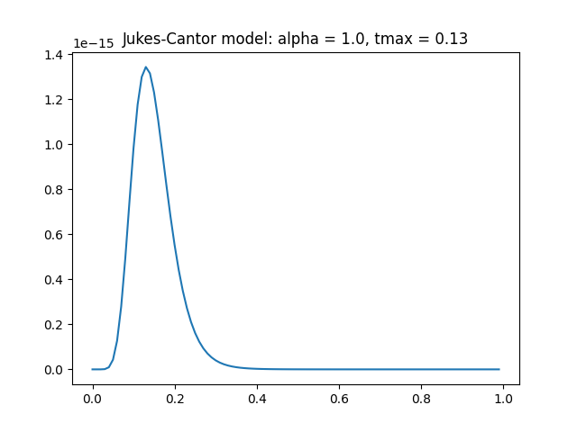
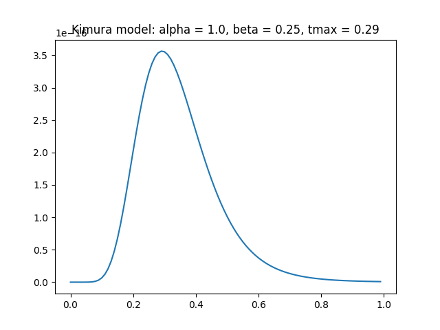

# GP_EVO
Calculating probabilities of sequences transforms with evolution model in time

# Example

```bash
# Jukes-Cantor model t-max transformation probability between two sequences
./evo.py demo/two_seqs.fasta tmax_plot --mode=jukes-cantor -o pJC.png

# same for Kimura model
./evo.py demo/two_seqs.fasta tmax_plot --mode=kimura -o pK.png

# simmilarity matrix
./evo.py demo/multi_seqs.fasta simmatrix -o simmatrix.txt
```

<html>
<body>
    <div>
        <h4>Jukes-Cantor model</h4>
        <p>
            
        </p>
        <h4>Kimura model</h4>
        <p>
            
        </p>
    </div>
</body>
</html>
